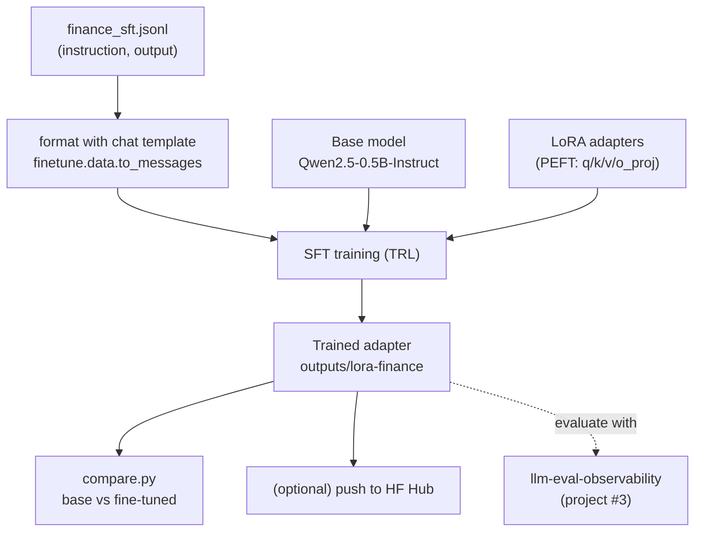

# Architecture

## Why LoRA

Full fine-tuning updates every weight — expensive and memory-hungry. **LoRA**
freezes the base model and trains tiny low-rank adapter matrices on a few
attention projections (`q/k/v/o_proj`). You get most of the benefit while
training <1% of the parameters, so it fits on a free Colab GPU and the
resulting adapter is only a few MB.

## Design choices

- **Small base model by default** (`Qwen2.5-0.5B-Instruct`) so the project is
  reproducible on free hardware; swap the `model` field for a larger one.
- **Chat-template formatting** uses the model's own template, so the fine-tune
  matches how the model is actually prompted at inference.
- **Pure, tested data layer** — formatting is unit-tested without torch.
- **Evaluation closes the loop** — measure the before/after model with
  [llm-eval-observability](https://github.com/arturio-amorim/llm-eval-observability)
  instead of eyeballing a couple of samples.
